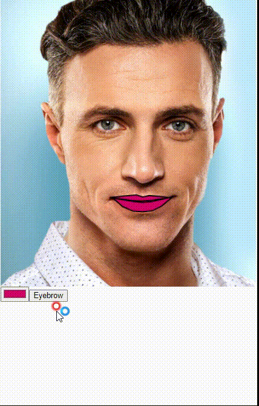

# faceApi를 이용한 미용 프로그램 팀프로젝트
## 팀원 : 이재경, 김기찬, 추승범, 엄재웅
## 소스코드 
``` java script

let img, parts;
let options = {withLandmarks: true, withDescriptors: false};
let button;
let colorPicker;
let Eb = 1;

function preload() {
  img = loadImage('face1.jpg');
}

function setup() {
  createCanvas(img.width, img.height);
  colorPicker = createColorPicker('#ed225d');
  button = createButton('Eyebrow');
  background(255); 
  noLoop();
}

function draw(){
  image(img, 0, 0);
  faceapi = ml5.faceApi(options, modelReady);
  button.mousePressed(Ebf);
}

function Ebf(){
  Eb *= -1;
}

function mousePressed(){
  redraw();//화면클릭하면 1번더실행
}

function modelReady() {
  faceapi.detectSingle(img, gotResults);
}

function gotResults(err, results) {
  if (err) {
    console.error(err);
    return;
  }
  console.log(results);
  parts = results.parts;
  stroke(0, 0, 255);
  strokeWeight(2);
  drawmouth();
  if(Eb > 0){
    draweyebrow();
  }
}

function drawmouth() {
  stroke(0);
  fill(colorPicker.color());
  beginShape();
  for(let i=0; i<parts.mouth.length; i++){
    vertex(parts.mouth[i]._x, parts.mouth[i]._y);
  }
    vertex(parts.mouth[0]._x, parts.mouth[0]._y);
  endShape();   
}

function draweyebrow(){ 
  stroke(255,0,255);
  noFill();
  beginShape();
  for(let i=0; i<parts.leftEyeBrow.length; i++){
    vertex(parts.leftEyeBrow[i]._x, parts.leftEyeBrow[i]._y);
  }
  endShape();

  beginShape();
  for(let i=0; i<parts.rightEyeBrow.length; i++){
    vertex(parts.rightEyeBrow[i]._x, parts.rightEyeBrow[i]._y);
  }
  endShape();
}
```

## 실행 결과


## 변형내용
*
*
*
*
*

## 소감
* 김기찬 이번 과제를 통해서 평소에도 관심을 가지고 있던 인공지능에 대해 직접적으로 체험해 볼 수 있었고 팀원들과 함께 입술과 눈썹을 변형하는 코드를 구상하면서 새로운 함수나 기능들을 찾아볼 수 있는 시간이 되었습니다. 알고리즘이나 유연한 사고의 필요성을 느끼게 되는 즐거운 과제였던 것 같습니다.
* 이재경
* 추승범
* 엄재웅


